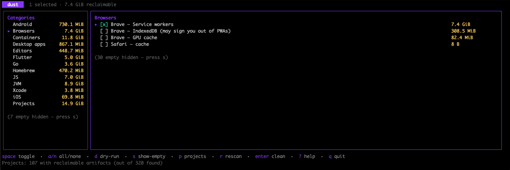
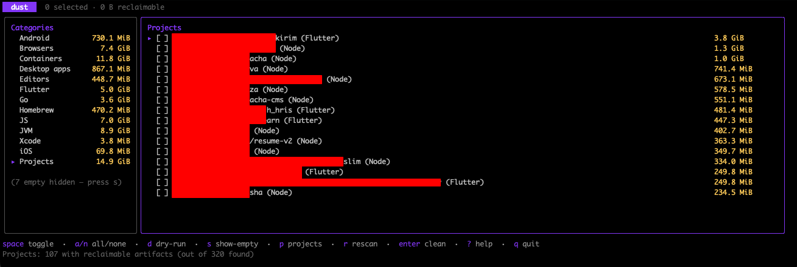

# dust

A cross-platform CLI for finding and cleaning the gigabytes of dev-tool, browser, and project caches that quietly fill up your disk. macOS and Linux. Single static binary. Interactive TUI, scriptable flags, dry-run by default.

---

## Highlights

- **99 cleaners across 19 categories.** Docker, JS package managers (yarn / npm / pnpm / bun / Deno), Gradle, Maven, pip, Conda, Go, Rust, Xcode, Android Studio + AVDs + SDK, Cypress / Playwright / Puppeteer, Homebrew, Trash, Time Machine local snapshots, iOS device backups + CocoaPods + Carthage, every major browser, JetBrains IDEs, Electron editors (VS Code / Cursor / Windsurf / VSCodium), Slack / Discord / Spotify, Linux thumbnails, macOS Quick Look, Composer, NuGet, Flutter pub-cache.
- **Project scanner.** Walks `~/Projects`, `~/Work`, `~/Code`, etc., detects 11 project kinds (Node / Flutter / Rust / Maven / Gradle / .NET / iOS / Go / Python / PHP / Ruby), reports per-project size, surfaces stale projects, and (optionally) runs the canonical clean tool (`flutter clean`, `cargo clean`, …) instead of blunt `rm -r`.
- **Two-pane TUI** powered by [bubbletea](https://github.com/charmbracelet/bubbletea) with live elapsed-time timer, verbose-log toggle, and a hard `y/N` confirmation gate before anything is deleted.
- **Safe by default.** `--dry-run` walks paths and reports sizes without touching anything. Path-prefix safety check refuses to delete `/`, `$HOME`, or anything outside its known cache roots. `--projects` skips dirty git trees unless you opt in.
- **Cross-platform.** Single static Go binary, no runtime deps. macOS amd64/arm64, Linux amd64/arm64. Windows planned for v2.

---

## Screenshots

Two-pane TUI — categories on the left, items on the right. Empty / unavailable rows are hidden by default; press `s` to reveal them.



Pressing `p` from the list view triggers the project scanner. Detected projects appear as a "Projects" category, ranked by reclaimable bytes, with the same select-and-clean flow as cache cleaners.



---

## Install

### One-line install (macOS + Linux)

```bash
curl -fsSL https://raw.githubusercontent.com/ariefsn/dust/main/install.sh | bash
```

The script detects your OS and architecture, downloads the right tarball from the latest GitHub Release, verifies the SHA256, and installs to `/usr/local/bin/dust` (or `~/.local/bin/dust` if `/usr/local/bin` isn't writable).

Environment overrides:

| Variable | Effect |
|---|---|
| `DUST_VERSION=v0.1.0` | Pin a specific tag instead of latest |
| `BIN_DIR=$HOME/bin` | Install elsewhere |

### `go install`

```bash
go install github.com/ariefsn/dust/cmd/dust@latest
```

### Manual download

Grab a pre-built binary from the [Releases page](https://github.com/ariefsn/dust/releases). Tarballs are named `dust_<version>_<os>_<arch>.tar.gz` with a `checksums.txt` alongside.

### From source

Requires Go 1.23+.

```bash
git clone https://github.com/ariefsn/dust.git
cd dust
make build
./dust --help
```

### Upgrade

Once installed, dust can update itself in place:

```bash
dust upgrade --check    # is there a newer release?
dust upgrade            # download + verify + replace
```

`dust upgrade` queries GitHub Releases, downloads the matching `dust_<version>_<os>_<arch>.tar.gz`, verifies its SHA256 against `checksums.txt`, and atomically swaps the running binary.

It refuses to run when:

- The current build is `dev` (built from source) — install a tagged release first.
- The binary lives under `$GOPATH/bin` or `$GOBIN` — use `go install github.com/ariefsn/dust/cmd/dust@latest` instead.

### Shell completion

`dust` ships with completion for **zsh**, **bash**, **fish**, and **PowerShell** via the `completion` subcommand. Pick your shell:

#### zsh (with [Oh My Zsh](https://ohmyz.sh))

```bash
mkdir -p ~/.oh-my-zsh/completions
dust completion zsh > ~/.oh-my-zsh/completions/_dust
# Restart your shell, or `exec zsh`.
```

#### zsh (plain)

```bash
# macOS (Homebrew):
dust completion zsh > $(brew --prefix)/share/zsh/site-functions/_dust

# Linux / BSD:
dust completion zsh > "${fpath[1]}/_dust"
```

If completion isn't already enabled in your `.zshrc`, add this once:
```bash
echo 'autoload -U compinit; compinit' >> ~/.zshrc
```

#### bash

```bash
# Linux:
dust completion bash | sudo tee /etc/bash_completion.d/dust >/dev/null

# macOS (with Homebrew bash-completion@2):
dust completion bash > $(brew --prefix)/etc/bash_completion.d/dust
```

#### fish

```fish
dust completion fish > ~/.config/fish/completions/dust.fish
```

#### Verifying

After reloading your shell, type `dust ` and press `<Tab>` — you should see all subcommands. `dust clean --category=` + `<Tab>` will list the categories. `dust clean --item=` + `<Tab>` lists every cleaner ID.

---

## Quick start

```bash
# Interactive TUI — the recommended way
dust

# Or use the CLI directly
dust scan                                  # see what's reclaimable, table view
dust scan --json | jq '.cleaners[].bytes'  # machine-readable output
dust list                                  # list every cleaner ID by category

# Preview cleaning everything (no deletes)
dust clean --all --dry-run

# Clean a specific category
dust clean --category=js --yes

# Clean a specific cleaner by ID (find IDs via `dust list`)
dust clean --item=docker --yes
dust clean --item=desktop-apps/discord/http-cache --yes

# Find stale project artifacts
dust scan --projects                       # auto-detects ~/Projects, ~/Work, etc.
dust scan --projects --root=~/Work         # specific parent path
dust scan --projects --stale-days=90       # only projects untouched >90 days

# Clean stale project build outputs (skips dirty git by default)
dust clean --projects --stale-days=180 --dry-run
```

---

## Commands

| Command | What it does |
|---|---|
| `dust` | Launches the interactive TUI |
| `dust scan` | Scans every cleaner concurrently, prints a category-grouped table or `--json` |
| `dust scan --projects` | Also walks project dirs and reports per-project size |
| `dust list` | Lists every cleaner ID grouped by category — use these IDs with `--item` |
| `dust list --categories` | Just the category names, one per line |
| `dust clean` | Deletes selected caches. Refuses to do anything without `--all`, `--category`, `--item`, or `--projects` |
| `dust config init` | Writes a default config file at the platform-appropriate path |
| `dust config show` | Prints the resolved config (file + env + flag merged) |
| `dust config path` | Prints where dust looks for config |
| `dust upgrade` | Replaces the running binary with the latest GitHub release |
| `dust upgrade --check` | Reports whether a newer version is available; doesn't modify anything |
| `dust version` | Prints the version, commit, and build date |

### `dust clean` flags

| Flag | Effect |
|---|---|
| `--all` | Select every available cleaner |
| `--category=<name>[,<name>...]` | Select all cleaners in a category (see `dust list --categories`) |
| `--item=<id>[,<id>...]` | Select specific cleaner IDs (see `dust list`) |
| `-n, --dry-run` | Walk paths, report sizes, delete nothing |
| `-y, --yes` | Skip the interactive `y/N` prompt — does **not** skip the path-safety check |
| `--projects` | Also clean stale project build outputs |
| `--root=<path>[,<path>...]` | Override project-scanner roots |
| `--stale-days=N` | Only clean projects untouched for N+ days |
| `--include-dirty` | Don't skip projects with uncommitted git changes |
| `--prefer-tool` | Prefer per-project clean tools (`flutter clean` etc.) over `rm -r` *(default true)* |

---

## TUI keys

| Key | Action |
|---|---|
| `↑/↓` or `j/k` | Navigate within the focused pane |
| `←/→` or `h/l` or `tab` | Switch between the categories pane and items pane |
| `space` | Toggle the highlighted item (or the whole category, if focus is on the left pane) |
| `a` / `n` | Select all / none in the current category |
| `enter` | Clean every selected item (asks for confirmation) |
| `d` | Toggle dry-run mode |
| `v` | Toggle verbose log during clean |
| `s` | Toggle show-empty (reveal hidden 0 B / not-installed rows) |
| `p` | Scan project dirs (~/Projects, ~/Work, ...) and add them as a category |
| `r` | Rescan everything |
| `?` | Toggle help screen |
| `q` or `ctrl+c` | Quit |

---

## Config file

dust reads a YAML config from `$XDG_CONFIG_HOME/dust/config.yaml`, defaulting to `~/.config/dust/config.yaml` on both macOS and Linux. The Linux-style path is used on macOS too (instead of `~/Library/Application Support`) so a single dotfiles repo works on both platforms.

Override with `--config <path>` or `DUST_CONFIG=<path>`.

Bootstrap a default config:

```bash
dust config init
dust config path     # show where it lives
dust config show     # print the merged config
```

Example config:

```yaml
# Global flag — equivalent to passing --verbose every invocation.
verbose: false

project_scanner:
  enabled: true

  # Project roots. If 'roots' is set it REPLACES auto-detection.
  # The usual case is to add a root or two via 'extra_roots' — those are
  # merged with the auto-detected list.
  # roots:
  #   - ~/MyStuff
  extra_roots:
    - ~/Work/Clients

  # Only show projects untouched for N days. 0 = no filter.
  stale_days: 90

  # Maximum directory depth to descend during the walk.
  max_depth: 8

  # Prefer per-project tools (flutter clean, cargo clean) over rm -r.
  # Falls back to rm -r if the tool isn't on $PATH or fails.
  prefer_tool: true
```

**Resolution precedence:** CLI flags > env vars (`DUST_VERBOSE=true`, etc.) > config file > defaults.

**Project root resolution:**

1. `--root` CLI flag — if given, replaces everything
2. `roots:` in config — if non-empty, replaces auto-detect
3. otherwise: auto-detect (`~/Projects`, `~/Work`, `~/Code`, `~/code`, `~/dev`, `~/src`, `~/repos`, `~/Documents/Projects`) **plus** anything in `extra_roots`

---

## What's covered

`dust list` will show the authoritative live inventory; here's the v1 surface:

### Dev tools

| Category | Cleaners |
|---|---|
| **Containers** | Docker (`docker system prune`) |
| **JS** | yarn, npm, pnpm (safe `store prune` + opt-in full wipe), bun |
| **JVM** | Gradle caches, Maven local repository |
| **Python** | pip cache |
| **Go** | module cache (`go clean -modcache`), build cache (`go clean -cache`) |
| **Rust** | Cargo registry cache, git db |
| **Xcode** *(macOS only)* | DerivedData, Archives (confirm-twice), iOS/watchOS/tvOS DeviceSupport, iOS Device Logs, Products, IB Support, Xcode app cache, CoreSimulator caches, `xcrun simctl delete unavailable` |
| **Android** | Android Studio caches & logs, AVD snapshots, `~/.android/cache` |
| **E2E** | Cypress, Playwright, Puppeteer (smart-prune via tool + path-delete fallback) |
| **Homebrew** | `brew cleanup -s` |

### Browsers (HTTP cache, GPU cache, Code cache, Service Workers, IndexedDB)

Chrome, Brave, Edge, Arc *(macOS only)*, Opera, Chromium, Firefox, Safari *(macOS only)*.

> Cookies, history, passwords, and bookmarks are **never** touched.

### Editors

JetBrains IDEs (auto-detects every installed product/version), VS Code, VS Code Insiders, Cursor, Windsurf, VSCodium.

### Desktop apps

Slack, Discord, Spotify *(macOS only)*.

### System

| OS | What |
|---|---|
| Linux | XDG thumbnails (`~/.cache/thumbnails/{normal,large,x-large,xx-large,fail}`), legacy `~/.thumbnails`, Thunar tumbler |
| macOS | Quick Look (`qlmanage -r cache`) |

### Trash

`~/.Trash` (macOS) / `~/.local/share/Trash` (Linux).

### iOS *(macOS only)*

Device backups under `~/Library/Application Support/MobileSync/Backup`.

### Project scanner

Detects projects by manifest. With `--prefer-tool=true` (the default) dust runs the canonical clean tool when it's available on `$PATH`; otherwise it falls back to a path-delete of the kind's artifact directories.

| Manifest | Kind | What gets cleaned |
|---|---|---|
| `package.json` | **Node** | `rm -r` of: `node_modules`, `.next`, `.nuxt`, `.svelte-kit`, `dist`, `build`, `.parcel-cache`, `.turbo`, `.cache` |
| `pubspec.yaml` | **Flutter** | `flutter clean` (which removes `build/`, `.dart_tool/`, `ephemeral/`, `ios/Pods/`) |
| `Cargo.toml` | **Rust** | `cargo clean` (removes `target/`) |
| `pom.xml` | **Maven** | `mvn clean -q` (removes `target/`) |
| `build.gradle[.kts]` | **Gradle** | `./gradlew clean` if the wrapper is present, else `gradle clean` (removes `build/`, `.gradle/`) |
| `*.csproj` / `*.sln` | **.NET** | `dotnet clean` (removes `bin/`, `obj/`) |
| `Podfile` | **iOS (CocoaPods)** | `rm -r Pods/` *(no tool action)* |
| `go.mod` | **Go** | `go clean` |
| `pyproject.toml` / `requirements.txt` / `setup.py` | **Python** | `rm -r` of: `.venv`, `venv`, `__pycache__`, `.pytest_cache`, `.mypy_cache`, `.ruff_cache`, `build`, `dist`, `*.egg-info` |
| `composer.json` | **PHP** | `rm -r vendor/` |
| `Gemfile` | **Ruby** | `bundle clean --force` (removes `.bundle/`, `vendor/bundle/`) |

A single project may match multiple kinds — e.g. a Flutter app with both `pubspec.yaml` and a `Podfile` gets `flutter clean` *and* the CocoaPods cleanup. Source files, lock files (`package-lock.json`, `Cargo.lock`, `pubspec.lock`, …), `.git/`, `.env`, and IDE settings (`.vscode/`, `.idea/`) are never touched. Projects with uncommitted git changes are skipped by default — pass `--include-dirty` (CLI) to override.

---

## Safety

- **`--dry-run`** walks every path, reports sizes, deletes nothing. Default mode for the TUI's first interaction.
- **Path-prefix check.** Every delete goes through `SafeRemoveAll`, which refuses paths equal to `/` or `$HOME`, or paths outside the registry's allowed roots.
- **Confirmation prompt.** `dust clean` prints what it'll do and asks `y/N` unless `--yes`. The TUI shows a confirmation modal before any clean.
- **Dirty-git skip.** `dust clean --projects` runs `git status --porcelain` per project and skips ones with uncommitted changes. Pass `--include-dirty` to override.
- **Available checks.** Every cleaner self-reports availability (binary on `$PATH`, cache dir present). Unavailable cleaners show as `not installed` in scan output and are skipped during clean.

---

## Examples

```bash
# What's reclaimable on this machine? (terminal-friendly)
dust scan

# Headlines only
dust scan --json | jq '[.cleaners[] | select(.bytes > 100000000)] | sort_by(-.bytes)'

# Pre-flight everything before nuking it
dust clean --all --dry-run

# Clean Docker + JS package managers, no prompt
dust clean --category=containers,js --yes

# Wipe just Brave's IndexedDB across every profile
dust clean --item=browsers/brave/indexeddb --yes

# Empty trash, then Quick Look thumbnails
dust clean --item=trash,system/quicklook --yes

# Audit project artifacts in ~/Work, hide noise
dust scan --projects --root=~/Work

# Clean stale projects (180+ days), tool-preferred, dry-run first
dust clean --projects --root=~/Work --stale-days=180 --dry-run

# Real run; skip projects with uncommitted changes (default behavior)
dust clean --projects --root=~/Work --stale-days=180 --yes
```

---

## Architecture

```
cmd/dust/main.go              entry point — wires cobra
internal/cli/                 cobra commands (scan, clean, list, config)
internal/tui/                 bubbletea two-pane TUI
internal/cleaner/             Cleaner interface + registry, OS-aware path helpers,
                              size walker, SafeRemoveAll, exec wrapper
internal/cleaners/            one file per category; subpackages for browsers/,
                              editors/, desktop_apps/, e2e/, projects/
internal/cleaners/projects/   manifest-driven project scanner
internal/config/              viper-backed config loader
internal/platform/            OS detection
```

Adding a new cleaner is normally a single file: implement the `Cleaner` interface (or use the `pathBased` helper), register it in `internal/cleaners/all.go`, and it shows up everywhere — TUI, `scan`, `list`, `clean --item`.

---

## Building

The Makefile wraps the common commands:

```bash
make build           # ./dust for the current platform
make run             # build + launch the TUI
make test            # go test ./...
make snapshot        # build a fake release with goreleaser (no upload)
make help            # full target list
```

`make build` injects version, git commit, and build date into the binary so `dust version` reports them. Plain `go build ./cmd/dust` still works — the binary just shows `dev / none / <date>`.

Binaries are statically linked, `CGO_ENABLED=0`. Drop them anywhere.

---

## Releasing

Releases are cut by pushing a `v*.*.*` tag. GitHub Actions then runs [goreleaser](https://goreleaser.com), which builds all four platform binaries, generates `checksums.txt`, and creates a GitHub Release with everything attached.

```bash
# 1. Make sure your working tree is clean and on main
git status
git pull

# 2. Sanity-check the release config locally (requires goreleaser installed)
brew install goreleaser/tap/goreleaser   # first time only
make release-check

# 3. Tag + push. Workflow at .github/workflows/release.yml takes over from here.
make release-tag VERSION=v0.1.0

# Watch progress at:
#   https://github.com/ariefsn/dust/actions
```

Once the workflow finishes (~2-3 min), the release is live at `github.com/ariefsn/dust/releases/tag/v0.1.0` with all four tarballs and `checksums.txt` attached. `install.sh` automatically picks up `latest`.

If the workflow fails after tagging, delete the tag and try again:

```bash
git tag -d v0.1.0
git push origin :refs/tags/v0.1.0
```

---

## License

MIT. See [LICENSE](LICENSE).

--

Inspired by [a blog post](https://ariefsn.dev/posts/clean-mac-storage)